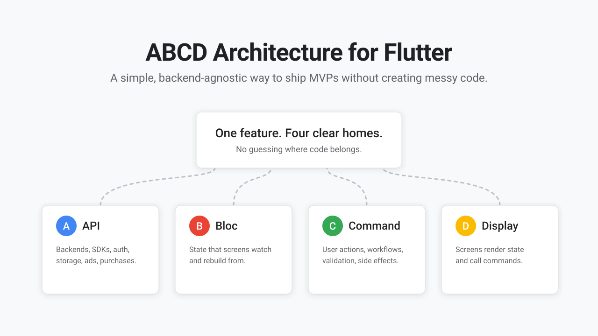
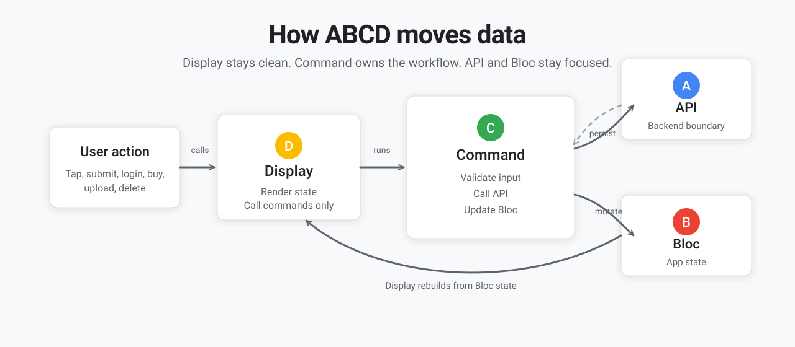

# ABCD Architecture for Flutter

<p align="center">
  
</p>

<p align="center">
  <strong>A structured, scalable architecture for Flutter applications.</strong><br>
  ABCD is a production-ready Flutter starter built around four intuitive layers:<br>
  <strong>API · Bloc · Command · Display</strong>
</p>

<p align="center">
  <a href="https://flutter.dev"></a>
  <a href="https://riverpod.dev"></a>
  <a href="LICENSE"></a>
  
</p>

<p align="center">
  <a href="#overview">Overview</a> ·
  <a href="#architecture-layers">Architecture Layers</a> ·
  <a href="#getting-started">Getting Started</a> ·
  <a href="#adding-a-feature">Adding a Feature</a> ·
  <a href="#included-features">Included Features</a> ·
  <a href="architecture_skill.md">AI Agent Guide</a>
</p>

---

## Overview

Most Flutter applications slow down during development when core architectural boundaries are undefined. Questions frequently arise regarding where to place API calls, state management, user actions, and backend data mappings.

**ABCD provides a predictable, standardized path for every feature.**

```text
Display → Command → API → Command → Bloc → Display
```

By enforcing a strict unidirectional flow, this architecture ensures that screens remain decoupled from business logic, backend services remain interchangeable, and feature development is consistently repeatable.

## Architecture Layers

ABCD is a lightweight, strictly-layered architecture designed for maintainability and scalability in Flutter applications.

| Layer | Letter | Responsibility | Path |
| --- | --- | --- | --- |
| **API** | **A** | Interfaces with external services (Mock, Firebase, Supabase, REST, local storage). | `lib/data/api/` |
| **Bloc** | **B** | Manages application and feature state. Provides a single source of truth for the Display layer. | `lib/data/bloc/` |
| **Command** | **C** | Orchestrates user workflows, input validation, side effects, API calls, and state updates. | `lib/data/command/` |
| **Display** | **D** | Renders UI based on Bloc state and triggers Commands in response to user events. | `lib/screens/` |

## Key Features

The ABCD architecture provides a production-ready application foundation.

| Feature | Description |
| --- | --- |
| **Local Mock Environment** | Build and test features immediately using an offline mock implementation, without configuring external services. |
| **Backend Agnosticism** | Transition between Mock, Firebase, Supabase, or custom REST backends seamlessly via a unified API boundary. |
| **Predictable Data Flow** | Every feature follows identical patterns, maintaining codebase clarity as the project scales. |
| **AI-Assisted Development** | Well-defined rules, naming conventions, and boundaries enable AI agents to generate correct, context-aware code. |
| **Integrated Services** | Pre-configured implementations for authentication, routing, local storage, monetization, and observability. |

## Data Flow

<p align="center">
  
</p>

### API Layer
The API layer forms the boundary between the application and external services (Mock, Firebase, Supabase, REST, etc.).
**Rule:** The API layer receives data and returns typed models or errors. It maintains no awareness of UI state, user commands, or blocs.

### Bloc Layer
The Bloc layer maintains application and feature state. Screens observe blocs and rebuild upon state modifications. Blocs expose synchronous mutation helpers (e.g., `updateLocally`).
**Rule:** Blocs do not orchestrate user workflows, side effects, or backend API calls.

### Command Layer
The Command layer processes user intent into application behavior. Commands orchestrate workflows such as authenticating users, synchronizing data, and processing purchases.
**Rule:** Commands coordinate operations between the API layer and the Bloc layer.

### Display Layer
The Display layer consists of Flutter UI components. Screens render state provided by blocs and trigger commands in response to user interaction.
**Rule:** The Display layer never interfaces directly with SDKs, APIs, or local storage.

## Getting Started

Initialize the project locally. Mock data mode is enabled by default, requiring no external service configuration.

```bash
git clone https://github.com/SuTechs/abcd_architecture_flutter.git my_app
cd my_app
flutter pub get
flutter run
```

Mock mode behavior:
- Supports any email or phone number input.
- OTP verification code is `123456`.
- Guest authentication is supported.
- Premium features and in-app purchase flows simulate successful transactions.

### Configuring External Backends

To integrate real services:

```bash
cp .config/config.example.json .config/config.dev.json
flutter run --dart-define-from-file=.config/config.dev.json
```

The `.config/config.dev.json` file is ignored by source control to secure API keys.

## Included Features

| Category | Components |
| --- | --- |
| Authentication | Email/phone OTP, Google Sign-In, Apple Sign-In, Guest mode |
| Backend Implementations | Mock, Firebase, Supabase, HTTP (Dio) |
| Local Storage | Hive CE (Key-value storage and JSON caching) |
| State Management | Riverpod (`Notifier`, `AsyncNotifier`) |
| Routing | GoRouter (Auth-aware redirects, deep linking) |
| Monetization | Google Mobile Ads (Banner, Native, Interstitial, Rewarded) |
| Purchases | In-app purchases, mock plans |
| Observability | Firebase Analytics, Crashlytics, FCM, internal logging |
| User Interface | Material 3 theme, adaptive layouts, shared widgets |

## Tech Stack

| Area | Packages and Tools |
| --- | --- |
| App framework | Flutter, Material 3 |
| State | `flutter_riverpod` |
| Navigation | `go_router` |
| Models | `freezed`, `json_serializable`, `build_runner` |
| Local storage | `hive_ce`, `hive_ce_flutter` |
| Firebase | `firebase_auth`, `cloud_firestore`, `firebase_storage`, `firebase_messaging`, `firebase_app_check`, `firebase_analytics`, `firebase_crashlytics` |
| Supabase | `supabase_flutter` |
| REST | `dio` |
| Social auth | `google_sign_in`, `sign_in_with_apple` |
| Ads | `google_mobile_ads` |
| Purchases | `in_app_purchase` |
| Utilities | `uuid`, `intl`, `timeago`, `connectivity_plus`, `crypto` |
| Quality | `flutter_test`, `flutter_lints` |

## Project Structure

```text
lib/
  app/
    config.dart                  # Environment configuration
    router/                      # Navigation and route definitions
    theme/                       # Material 3 theme implementation
  data/
    api/
      core/                      # Abstract BaseApiService and feature mixins
      local/                     # LocalStorageService implementation
      mock/                      # Offline mock repositories
      firebase/                  # Firebase repositories
      supabase/                  # Supabase repositories
      http/                      # REST repositories
      providers.dart             # Dependency injection providers
      services/                  # Auxiliary services (Logger, Analytics, IAP)
    bloc/                        # Riverpod state notifiers
    command/                     # Business logic and workflow orchestration
    data/                        # Freezed models and entities
  screens/                       # Presentation layer
  widgets/                       # Reusable UI components
  main.dart                      # Application entry point
```

## Adding a Feature

Example implementation of a `notes` feature.

### 1. Define the Data Model

Create `lib/data/data/note/note_data.dart`.

```dart
import 'package:freezed_annotation/freezed_annotation.dart';

part 'note_data.freezed.dart';
part 'note_data.g.dart';

@freezed
class NoteData with _$NoteData {
  const NoteData._();

  const factory NoteData({
    required String id,
    required String userId,
    required String title,
    @Default('') String body,
    required DateTime createdAt,
    required DateTime updatedAt,
  }) = _NoteData;

  factory NoteData.fromJson(Map<String, dynamic> json) =>
      _$NoteDataFromJson(json);
}
```

Generate the serialization code:

```bash
dart run build_runner build --delete-conflicting-outputs
```

### 2. Define the API Contract

Create `lib/data/api/core/note_api_extension.dart`.

```dart
import '../../data/note/note_data.dart';

mixin NoteApiMixin {
  Future<List<NoteData>> getNotes(String userId);
  Future<NoteData> addNote(NoteData note);
  Future<void> updateNote(NoteData note);
  Future<void> deleteNote(String noteId);
}
```

Include the mixin within `BaseApiService`, and provide concrete implementations in the active backend repositories.

### 3. Create the Bloc

Create `lib/data/bloc/note_bloc.dart`.

Implement a `Notifier` to maintain the list of notes and provide synchronous state mutation methods.

### 4. Create the Command

Create `lib/data/command/note/note_command.dart`.

Implement a class extending `BaseCommand` to orchestrate side effects (e.g., `addNote`). The command validates inputs, delegates persistence to the API layer, and updates the Bloc.

### 5. Create the Display

Create screens within `lib/screens/notes/`.

Utilize `ref.watch(noteBlocProvider)` to observe state and invoke `NoteCommand().addNote(...)` during user interactions.

## Backend Configuration

The application utilizes `MockService` by default via dependency injection in `lib/data/api/providers.dart`.

To switch backend implementations, override `apiServiceProvider` during bootstrap in `lib/data/command/app/bootstrap_command.dart`:

```dart
final container = ProviderContainer(
  overrides: [
    apiServiceProvider.overrideWithValue(FirebaseService()),
  ],
);
```

| Service Implementation | Use Case |
| --- | --- |
| `MockService` | Offline development, testing, UI prototyping |
| `FirebaseService` | Production backend utilizing Firebase ecosystem |
| `SupabaseService` | Production backend utilizing Supabase ecosystem |
| `HttpService` | Custom RESTful backend integrations |

## Removing Unused Integrations

ABCD is distributed with comprehensive integrations. Unused modules should be removed to minimize dependency overhead.

| Module | Removal Instructions |
| --- | --- |
| Supabase | Delete `lib/data/api/supabase/`, remove `supabase_flutter` from pubspec.yaml. |
| Firebase | Delete `lib/data/api/firebase/`, remove related firebase packages. |
| REST | Delete `lib/data/api/http/`, remove `dio`. |
| Monetization | Delete `lib/widgets/ads/`, remove `google_mobile_ads`. |
| Purchases | Delete premium screens, purchase commands, remove `in_app_purchase`. |

Post-removal validation:

```bash
flutter pub get
dart analyze
flutter test
```

## Architecture Comparison

| Aspect | Clean Architecture | ABCD Architecture |
| --- | --- | --- |
| Layers | Data, Domain, Presentation | API, Bloc, Command, Display |
| Primary Use Case | Complex enterprise domains | Rapid product iteration and MVPs |
| Abstraction Level | High | Low |

ABCD serves as a streamlined foundation that supports the incremental adoption of more rigorous domain layers as the application complexity increases.

## Development Commands

```bash
# Install dependencies
flutter pub get

# Generate data models and serializers
dart run build_runner build --delete-conflicting-outputs

# Execute static analysis
dart analyze

# Execute test suite
flutter test

# Execute with environment configuration
flutter run --dart-define-from-file=.config/config.dev.json

# Compile release artifacts
flutter build apk --dart-define-from-file=.config/config.dev.json
flutter build ios --dart-define-from-file=.config/config.dev.json
```

## Testing Guidelines

The repository includes a comprehensive test suite covering:
- API repository behavior.
- Command-level authentication and CRUD workflows utilizing memory storage.
- UI widget layout rendering.

When implementing new features, prioritize Command layer tests. Because commands encapsulate all critical business logic and orchestration, they provide the highest confidence validation.

## Release Checklist

- [ ] Update `applicationId` and bundle identifier.
- [ ] Replace launcher icons and splash screen assets.
- [ ] Remove unused backend service implementations.
- [ ] Replace placeholder AdMob unit IDs with production identifiers.
- [ ] Configure production in-app purchase products.
- [ ] Verify compliance with data privacy policies (Analytics, Crashlytics, Auth).
- [ ] Validate static analysis (`dart analyze` returns zero issues).
- [ ] Validate test suite (`flutter test` passes successfully).

## Troubleshooting

| Issue | Resolution |
|---|---|
| OTP authentication fails | In `MockService`, use `123456`. For production backends, verify environment variables and `apiServiceProvider` overrides. |
| Freezed classes missing | Execute `dart run build_runner build --delete-conflicting-outputs`. |
| Configuration empty | Ensure the `--dart-define-from-file=.config/config.dev.json` flag is provided during execution. |
| Backend initialization fails | Inspect application logs and verify native platform configurations. |
| Hive storage test errors | Utilize `test/helpers/memory_local_storage_service.dart` within test environments. |

## Contributing

Contributions improving the architecture, documentation, or test coverage are welcome. 

Before submitting a Pull Request:
- Adhere strictly to the ABCD layer boundaries.
- Ensure `MockService` functions independently without external dependencies.
- Update `architecture_skill.md` if architectural conventions are modified.
- Execute `dart analyze` and `flutter test`.

## License

This project is licensed under the MIT License.
